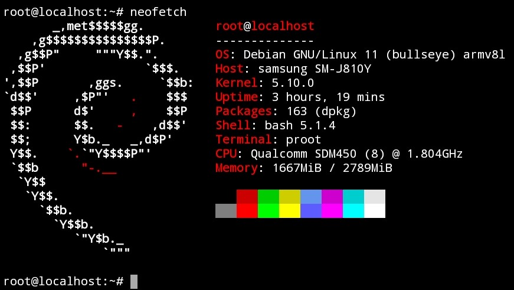

## Debian 11 (Bullseye) in Termux

## Installation
```
curl --silent --location --remote-name https://github.com/trungtai33/debian-bullseye-in-termux/raw/master/installation/debian-bullseye.sh && bash debian-bullseye.sh && rm debian-bullseye.sh
```
After installation, run ```start-debian-bullseye``` to login.
## Uninstall
Be careful when using this command as it does not ask for confirmation.
```
curl --silent --location --remote-name https://github.com/trungtai33/debian-bullseye-in-termux/raw/master/uninstall/debian-bullseye.sh && bash debian-bullseye.sh && rm debian-bullseye.sh
```
